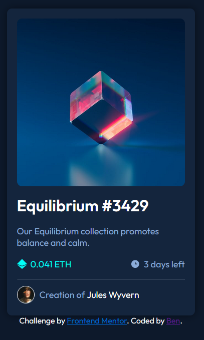

# Frontend Mentor - NFT preview card component solution

This is a solution to the [NFT preview card component challenge on Frontend Mentor](https://www.frontendmentor.io/challenges/nft-preview-card-component-SbdUL_w0U). Frontend Mentor challenges help you improve your coding skills by building realistic projects.

## Table of contents

- [Overview](#overview)
  - [The challenge](#the-challenge)
  - [Screenshot](#screenshot)
- [My process](#my-process)
  - [Built with](#built-with)
  - [Continued development](#continued-development)
- [Author](#author)

## Overview

My first ever attempt at anything like this before. Great way to get back into the swing of things by doing!

### The challenge

Users should be able to:

- View the optimal layout depending on their device's screen size
- See hover states for interactive elements

### Screenshot

## My process

### Built with

- Semantic HTML5 markup
- CSS & SASS
- Flexbox

### Continued development

I didn't manage to get the hover affect on the NFT logo exactly correct. Given more time im sure a solution would have come up with either tinkering and / or google.

Other than improving my CSS skills and understanding of flexbox without trial and erroring much, the skills aren't very difficult anymore.

## Author

- Frontend Mentor - [@yourusername](https://www.frontendmentor.io/profile/bennyfreemantle)
